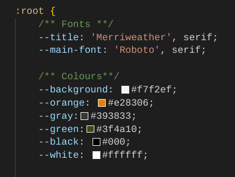

<h1 align="center"><strong>McCarthy's Bistro Website</strong></h1>

<h3 align="center">Full-Stack Project (HTML5, CSS3, Bootstrap, Django, Python, JavaScript, jQuery, PostgreSQL, Cloudinary)</h3>

 

**Developer:** Ayla McCarthy

**[View live website here](https://mccarthys-bistro.herokuapp.com/)**  :computer:

# Table of Content
 * [Overview](#overview)
  * [UX](#ux)
    + [Strategy](#strategy)
    + [Scope](#scope)
    + [Structure](#structure-hr-)
    + [Skeleton](#skeleton-hr-)
    + [Surface](#surface-hr-)
      - [Color Scheme](#color-scheme)
      - [Fonts](#fonts)
      - [Visual Effects](#visual-effects)
  * [Agile Methodology](#agile-methodology)
  * [Features](#features)
    + [Existing Features](#existing-features)
      - [Create bookings](#create-bookings)
      - [Reviews](#reviews)
      - [Menu](#menu)
      - [Profiles](#profiles)
      - [Staff bookings management](#staff-bookings-management)
    + [Future Feature Considerations](#future-feature-considerations)
  * [Responsive Layout and Design](#responsive-layout-and-design)
  * [Tools Used](#tools-used)
    + [Python packages](#python-packages)
  * [Testing](#testing)
  * [Deployment](#deployment)
    + [Deploy on heroku](#deploy-on-heroku)
    + [FORK THE REPOSITORY](#fork-the-repository)
    + [CLONE THE REPOSITORY](#clone-the-repository)
  * [Credits](#credits)
    + [Content](#content)
    + [Media](#media)
    + [Code](#code)
  * [Acknowledgements](#acknowledgements)

# Overview

McCarthy's Bistro Website was created as Portfolio Project #4 (Full-Stack Toolkit) for Diploma in Full Stack Software Development at [Code Institute](https://www.codeinstitute.net).

Project purpose was to build a full-stack site using agile methodology to plan and design web application using MVC framework and related contemporary technologies. Appplication offers users full CRUD (create, read, update, delete) functionality.

This is a project designed and developed to create a complete experience for the clients of McCarthy's Bistro. The clients/guests are given opportunity to create an account, manage their account, create a booking and post a review.

This project is very much a personal one. Having been in the hospitality industry for most of my career and having almost 15 years culinary experience, this website look exactly as how I imagine my dream restaurant located in my hometown would look like.

## UX
This site was created respecting the Five Planes Of Website Design: 
### Strategy

**User Stories:**  

|   EPIC                                |ID|                                User Story                                                   |
| :-------------------------------------|--|:------------------------------------------------------------------------------------------- |
|**CONTENT AND NAVIGATION**             |  ||
|                                       |1A| As a user, I want to see a menu so I can easily navigate through website content |             
|                                       |1B| As a user, I want to see relevant information about the restaurant|
|                                       |1C| As a user, I want the website to have a nice and intuitive design that will match the restaurant's theme|
|**USER REGISTRATION/AUTENTHICATION**   |  || 
|                                       |2A| As a user, I want to be able to register on the website|
|                                       |2B| As a user, I want to be able to authenticate using only email and password|
|                                       |2C| As a user, I want to be able to log out at any time|
|**BOOKING**                            |  ||
|                                       |3A| As a logged-in user, I want to be able to find the available tables for a specific date and time|
|                                       |3B| As a logged-in user, I want to be able to select the table that I want to reserve|
|**MENU**                               |  ||
|                                       |4A| As a user, I want to see the restaurant's menu with details about ingredients and price, so that I can make an informed decision|
|                                       |4B| As a logged-in user, I want to be able to mark my favourite dishes on the menu|
|**USER PROFILE**                       |  ||
|                                       |5A| As a logged-in user, I want to view a list of my upcoming bookings|
|                                       |5B| As a logged-in user, I want to be able to cancel my bookings|
|                                       |5C| As a logged-in user, I want to see a list of my favourite dishes from the restaurant|
|**STAFF MANAGE BOOKINGS**              |  ||
|                                       |6A| As a logged-in staff member, I want to see the restaurant's upcoming bookings for the current day sorted by time|
|                                       |6B| As a logged-in staff member, I want to be able to filter bookings by date|
|                                       |6C| As a logged-in staff member, I want to be able to cancel bookings|
|**REVIEWS**                            |  ||
|                                       |7A| As a user, I want to see the restaurant's customer reviews on the website|
|                                       |7B| As a logged-in user, I want to be able to post and edit a review|
|**CONTACT**                            |  ||
|                                       |8A| As a user, I want to see the restaurant's opening and closing hours|
|                                       |8B| As a user, I want to see location information on the website|
|                                       |8C| As a user, I want to see contact information on the website|

**Project Goal:** 
To create a website for McCarthy's Bistro restaurant that will be beneficial for both clients and staff members which aims to maximise clients/customers experience and staff productivity, ultimately maximising the restaurant's revenue.

**Project Objectives:**  
* To create a website with a simple and intuitive User Experience design;
* To add relevant content that aims to create a better image/branding of the restaurant;
* To differentiate between client and staff member accounts;
* To implement fully functional features that will ease the staff members' tasks and upgrade clients' experience with the restaurant services;
* To make the website fully responsive, and available and functional on every device.  

### Scope

**Simple and intuitive User Experience** 
* Ensure the navigation menu is visible and functional at every step;
* Ensure every page has a suggestive name that fits its content;
* Ensure the users will get visual cues and feedback when navigating through pages;
* Create a design that  is clear, precise, engaging and matches the restaurant theme.

**Relevant content** 
* Add information about restaurant name, location and contact data;
* Make a clear beautifully designed presentation of the menu elements;
* Create a booking section that is easy to navigate;
* Create a profile section that aims to address clients dietary requirements/requests.

**Different client and staff member Accounts** 
* Allow clients to add, update or delete bookings their own bookings;
* Allow admin and staff members to add, update or delete bookings;
* Allow admin and staff members to add, update or delete menu items;
* Allow signed in clients access to Profile page;
* Allow access to Manage Bookings page only for staff members type of users;

**Responsiveness** 
* Create a responsive design for desktop, tablet and mobile devices.  

### Structure

The structure of the website is divided into eight pages but with content depending on authentication and client/staff status  
-**Register/Login** pages give the user the possibility to create an account and authenticate for accessing different features. 
-**Logout** feature is a modal that helps user exit their current account; 
-The **Home** page is visible for both types of users and includes details about the restaurant, and appropriate links to different pages; 
-The **Menu** page displays menu details and a suggestive message for clients to inform the restaurant if they have any food allergies or special dietary requirements; 
-The **Booking** page is only available for logged-in users, both clients and staff members; 
-**Where to find us** contains  relevant information visible to all users; 
-**Profile** page is only visible for the logged-in clients and give them possibility to request for any dietary requirements by editing their profile information; 
_**Manage Bookings** page gives access only to staff members and displays all the bookings registered, with date, time, and number of guests information. 

* FLOWCHARTS  
The Flowchart for my program was created using <b>LucidChart</b> and it visually represents how the system works. 
 

### Skeleton

**Wireframes** 
The wireframes for mobile and desktop were created with [Balsamiq](https://balsamiq.com/) tool.

Home Page

Menu Page

Bookings Page

The final finished project has slight deviations from these initial wireframes made but due to time constraint I was not able to finish an updated wireframes that completely reflects the final project. But I will make sure to update this on future release. 

**Database** 

Project uses cloud-based PostgreSQL database provided by [ElephantSQL](https://www.elephantsql.com/) as a service. ElephantSQL is known for its ease of use, reliability, and is a popular choice for Django projects that requires PostgreSQL database. It offers web interface with console for SQL queries. Database URL including API key is stored as enviromental variable in heroku.
 
The diagram below was created before the actual development of the website which led to some changes to the attributes and tables for finding the most relevant and useful ones to be kept. Due to time constraint I was not able to make an updated version on time, but I will make sure to update this on future release.

Initial Schema

### Surface

#### Color Scheme
All the colors were selected using the hero image to generate color scheme using coolors (https://coolors.co/generate)

.png)

For consistency and convenience, I created css root variables that I used throughout the project.

#### Fonts
* The fonts I used for this site were imported from [Google Fonts](https://fonts.google.com/): 
The [Roboto](https://fonts.google.com/specimen/Roboto?query=roboto) font is the main font used throughout the whole website with Sans Serif as the fallback. Roboto is a clean, modern looking and well known font. It is sourced from Google fonts and it's linked to css document via @import method.
  I created css root variables using the other fonts below that I used throughout the project.
   
**Body:** *Roboto* 
**Navbar:** *Lato, cursive* 
**Slogan:** *Merriweather, cursive* 

#### Visual Effects
* **Box shadows**  
Multiple box shadows were used for the cover, buttons and images. They were inspired from [css-box-shadow-examples]("https://getcssscan.com/css-box-shadow-examples") 

* **Animation** 
Some animations were used for creating a dynamic and attractive design and give users visual cues. 
**Dropdown Arrow Animation** To prompt user to scroll down to see more content. 

  
View Moving arrows animation

    
  

* **Hover effects**  
Multiple Hover effects are also used throughout the site. 
 NavBar Elements Hover  
 Buttons Hover 
 Footer Elements Hover 
 Back to top Button  

## Agile Methodology
This project was developed utilising the Agile Methodogy. 
This is the first time I used Agile methodology when planning full-stack django website with a focus on delivering the basic app functionalities. I prioritized features by labeling them as "must-have" or "could-have" and moved some less critical ones to future development. To guide my development process, I created user stories for both the admin/staff user and guests/clients/customers. These stories helped to define the features and functionalities that were most important to project's target audience.

As a student solo developer who was learning a lot during development, I faced challenges in estimating the time required for each task and only had a basic concept of what I would create. Therefore, I kept things simple and focused on achievable goals. Aiming for Minimum Viable Product, or MVP.

To keep track of progress,Github Projects. I used a kanban board divided into following sections: "to do", "in progress" "done", "future enhancements" and "bugs" that allowed me to visualize all tasks and prioritize next steps. However, I could not find the "epics" feature in GitHub Projects, only milestones (it provides only [milestones and issues](https://docs.github.com/en/issues/tracking-your-work-with-issues/about-issues)). Epics are supposed to be larger in scope than milestones, representing a significant amount of work. Milestones, on the other hand, are meant to mark significant points in time in terms of project completion. In this document, I added epics, but on the project board, I used only [milestones](https://github.com/Aylamccarthy/mccarthys-bistro-restaurant-booking-system/milestones) to stay in order with GitHub's features.

By using agile methodology, I was able to stay organized and focused on delivering the most important features, while also allowing flexibility for future development. This experience gave me valuable insight and lessons that I can apply to future projects.

| Epic | Milestone | User stories |
|------|-----------|--------------|
| Epic 1: BASIC SITE FUNCTIONALITY| Milestone 1: Project SetUp |  [#46](https://github.com/Aylamccarthy/mccarthys-bistro-restaurant-booking-system/issues/46) [#43](https://github.com/Aylamccarthy/mccarthys-bistro-restaurant-booking-system/issues/43) [#65](https://github.com/Aylamccarthy/mccarthys-bistro-restaurant-booking-system/issues/65)
|  |Milestone 2: Content and Navigation |[#59](https://github.com/Aylamccarthy/mccarthys-bistro-restaurant-booking-system/issues/59) [#58](https://github.com/Aylamccarthy/mccarthys-bistro-restaurant-booking-system/issues/58) [#44](https://github.com/Aylamccarthy/mccarthys-bistro-restaurant-booking-system/issues/44) [#45](https://github.com/Aylamccarthy/mccarthys-bistro-restaurant-booking-system/issues/45)
|   |Milestone 3: Contact   | [#62](https://github.com/Aylamccarthy/mccarthys-bistro-restaurant-booking-system/issues/62)  [#60](https://github.com/Aylamccarthy/mccarthys-bistro-restaurant-booking-system/issues/60) [#61](https://github.com/Aylamccarthy/mccarthys-bistro-restaurant-booking-system/issues/61)
| Epic 2: USER MANAGEMENT| Milestone 4 : User Profile | [#53](https://github.com/Aylamccarthy/mccarthys-bistro-restaurant-booking-system/issues/53) [#55](https://github.com/Aylamccarthy/mccarthys-bistro-restaurant-booking-system/issues/55)
|   |Milestone 5: User Registration/Authentication | [#48](https://github.com/Aylamccarthy/mccarthys-bistro-restaurant-booking-system/issues/48) [#49](https://github.com/Aylamccarthy/mccarthys-bistro-restaurant-booking-system/issues/49)
|   |Milestone 6: Reviews  | [#57](https://github.com/Aylamccarthy/mccarthys-bistro-restaurant-booking-system/issues/57) [#58](https://github.com/Aylamccarthy/mccarthys-bistro-restaurant-booking-system/issues/58)
| Epic 3: CONTENT MANAGEMENT| Milestone 7: Menu| [#59](https://github.com/Aylamccarthy/mccarthys-bistro-restaurant-booking-system/issues/59) [#44](https://github.com/Aylamccarthy/mccarthys-bistro-restaurant-booking-system/issues/44)
|   |Milestone 8: Booking  | [#52](https://github.com/Aylamccarthy/mccarthys-bistro-restaurant-booking-system/issues/52) [#51](https://github.com/Aylamccarthy/mccarthys-bistro-restaurant-booking-system/issues/51) [#50](https://github.com/Aylamccarthy/mccarthys-bistro-restaurant-booking-system/issues/50) [#54](https://github.com/Aylamccarthy/mccarthys-bistro-restaurant-booking-system/issues/54)
|   |Milestone 9: Staff/Admin Manage Bookings  | [#56](https://github.com/Aylamccarthy/mccarthys-bistro-restaurant-booking-system/issues/56) [#55](https://github.com/Aylamccarthy/mccarthys-bistro-restaurant-booking-system/issues/55)
| Epic 4: PROJECT WRAP UP| Milestone 10: Comprehensive Testing and Code Validations| [#63](https://github.com/Aylamccarthy/mccarthys-bistro-restaurant-booking-system/issues/63)
|   |Milestone 11:Tidying up and Final Project Deployment| [#64](https://github.com/Aylamccarthy/mccarthys-bistro-restaurant-booking-system/issues/64) 

View Sprints Details

* **Sprint 1 - SETUP** 
    -Setup Django 
    -Deploy on heroku  
* **Sprint 2 - CONTENT AND NAVIGATION** 
    -Create a navigation menu 
    -Add restaurant name, slogan and description 
    -Choose colors, fonts and decorative images   
   
* **Sprint 3 - USER REGISTRATION/AUTENTHICATION** 
    -Implement the *Register* page using the django-allauth module 
    -Implement the *Login* page using django-allauth module 
    -Implement *Logout* modal using django-allauth module  
    
* **Sprint 4 - BOOKING** 
    -Create *Booking* page 
    -Implement a feature to display available dates and times 
    -Implement booking form validation  
   
* **Sprint 5 - USER PROFILE** 
    -Create user *Profile* page 
    -Implement *Upcoming bookings* section  
    
* **Sprint 6 - STAFF MANAGE BOOKINGS** 
    -Create a *Manage Bookings* page to display all bookings 
    -Implement filtering by date form 
   
* **Sprint 7 - REVIEWS** 
    -Create a *Reviews* page to display all reviews 
    -Implement form for adding and updating review 
   
* **Sprint 8 - MENU** 
    -Create a *Menu* page to display menu details 
    -Implement a feature for adding, updating or deleting menu for authenticated staff member 
    
* **Sprint 9 - CONTACT** 
    -Create *Where to find us* page 
    -Add timetable 
    -Add location address and map 
    -Add contact details 
   
* **Sprint 10 - TESTING, VALIDATION, FINAL DEPLOYMENT** 
    - Complete thorough manual testing.
    - Complete thorough validation
    - Final deployment

  

## Features
### Existing Features

### Navbar and main menu

Bootstrap navbar component was used to create the navigation bar. It is always visible and stays fixed at the top of the screen. Navbar consists of Restaurant logo and links to main areas of the site (home, menu, contact pages, Login and Register). 

  
'Logout', 'Profile', 'Bookings and 'Make a Booking' buttons(displayed to unauthenticated users) are also present.  
 

### Footer

The footer consists of copyright info and quick navigation to social media links with icons, allowing guests to connect with the brand on popular social media platforms.
  
 

## Credits
- Daisy McGirr Django Project Youtube Tutorials (https://www.youtube.com/watch?v=cPfvhpdYaNY&list=PLXuTq6OsqZjbCSfiLNb2f1FOs8viArjWy&index=2)
- <a href="https://www.freepik.com/free-photo/table-set-dinning-table_1241148.htm#query=bistro%20restaurant&position=7&from_view=keyword&track=ais">Image by topntp26</a> on 
- © <a href='https://www.123rf.com/profile_virtosmedia'>virtosmedia</a>, <a href='https://www.123rf.com/free-images/'>123RF Free Images</a>
- https://www.youtube.com/watch?v=Alua227cOmY Used for extending the User model by creating a Profile app
- pexels.com
- How to create the Profile app inspiration can be found here: (https://www.youtube.com/watch?v=dGnRsNH81Ik&list=PLXuTq6OsqZjYSa-lrjd5wMGl23zpnhvln&index=2)
- Update and Delete User Profile Model taken and modified to suit the app needs, here: ( https://www.youtube.com/watch?v=F5kTZdi_c5k&t=151s)
- I use this website to resize my images: (https://picresize.com/)
- W3schools (https://www.w3schools.com/)
### Code
- Toasts code taken and modified from here: (https://www.w3schools.com/bootstrap4/bootstrap_toast.asp) 
(https://getbootstrap.com/docs/4.3/components/toasts/)

- https://github.com/jts272/hello-django#developmentproduction-environments (For setting Development/Production environments )
- Resizing Images (https://www.w3schools.com/css/css3_object-fit.asp)
- Inspiration for reviews app was taken from and modified from here: (https://github.com/Code-Institute-Solutions/PP4_masterclass/tree/main)

Black - Black is a PEP 8 compliant opinionated formatter. Used to format code.
