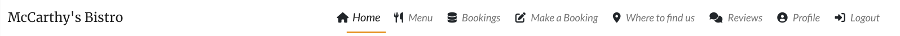
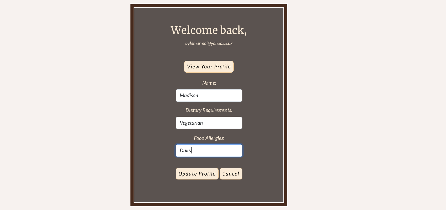

<h1 align="center"><strong>McCarthy's Bistro Website</strong></h1>

<h3 align="center">Full-Stack Project (HTML5, CSS3, Bootstrap, Django, Python, JavaScript, jQuery, PostgreSQL, Cloudinary)</h3>

<br>

**Developer:** Ayla McCarthy

**[View live website here](https://mccarthys-bistro.herokuapp.com/)**  :computer:


# Table of Content
 * [Overview](#overview)
  * [UX](#ux)
    + [Strategy](#strategy)
    + [Scope](#scope)
    + [Structure](#structure-hr-)
    + [Skeleton](#skeleton-hr-)
    + [Surface](#surface-hr-)
      - [Color Scheme](#color-scheme)
      - [Fonts](#fonts)
      - [Visual Effects](#visual-effects)
  * [Agile Methodology](#agile-methodology)
  * [Features](#features)
    + [Existing Features](#existing-features)
      - [Create bookings](#create-bookings)
      - [Reviews](#reviews)
      - [Menu](#menu)
      - [Profiles](#profiles)
      - [Staff bookings management](#staff-bookings-management)
    + [Future Feature Considerations](#future-feature-considerations)
  * [Responsive Layout and Design](#responsive-layout-and-design)
  * [Tools Used](#tools-used)
    + [Python packages](#python-packages)
  * [Testing](#testing)
  * [Deployment](#deployment)
    + [Deploy on heroku](#deploy-on-heroku)
    + [FORK THE REPOSITORY](#fork-the-repository)
    + [CLONE THE REPOSITORY](#clone-the-repository)
  * [Credits](#credits)
    + [Content](#content)
    + [Media](#media)
    + [Code](#code)
  * [Acknowledgements](#acknowledgements)


# Overview

McCarthy's Bistro Website was created as Portfolio Project #4 (Full-Stack Toolkit) for Diploma in Full Stack Software Development at [Code Institute](https://www.codeinstitute.net).

Project purpose was to build a full-stack site using agile methodology to plan and design web application using MVC framework and related contemporary technologies. Appplication offers users full CRUD (create, read, update, delete) functionality.

This is a project designed and developed to create a complete experience for the clients of McCarthy's Bistro. The clients/guests are given opportunity to create an account, manage their account, create a booking and post a review.

This project is very much a personal one. Having been in the hospitality industry for most of my career and having almost 15 years culinary experience, this website look exactly as how I imagine my dream restaurant located in my hometown would look like.

## UX
This site was created respecting the Five Planes Of Website Design:<br>
### Strategy<hr>
**User Stories:** <br>

|   EPIC                                |ID|                                User Story                                                   |
| :-------------------------------------|--|:------------------------------------------------------------------------------------------- |
|**CONTENT AND NAVIGATION**             |  ||
|                                       |1A| As a user, I want to see a menu so I can easily navigate through website content |             
|                                       |1B| As a user, I want to see relevant information about the restaurant|
|                                       |1C| As a user, I want the website to have a nice and intuitive design that will match the restaurant's theme|
|**USER REGISTRATION/AUTENTHICATION**   |  || 
|                                       |2A| As a user, I want to be able to register on the website|
|                                       |2B| As a user, I want to be able to authenticate using only email and password|
|                                       |2C| As a user, I want to be able to log out at any time|
|**BOOKING**                            |  ||
|                                       |3A| As a logged-in user, I want to be able to find the available tables for a specific date and time|
|                                       |3B| As a logged-in user, I want to be able to select the table that I want to reserve|
|**MENU**                               |  ||
|                                       |4A| As a user, I want to see the restaurant's menu with details about ingredients and price, so that I can make an informed decision|
|                                       |4B| As a logged-in user, I want to be able to mark my favourite dishes on the menu|
|**USER PROFILE**                       |  ||
|                                       |5A| As a logged-in user, I want to view a list of my upcoming bookings|
|                                       |5B| As a logged-in user, I want to be able to cancel my bookings|
|                                       |5C| As a logged-in user, I want to see a list of my favourite dishes from the restaurant|
|**STAFF MANAGE BOOKINGS**              |  ||
|                                       |6A| As a logged-in staff member, I want to see the restaurant's upcoming bookings for the current day sorted by time|
|                                       |6B| As a logged-in staff member, I want to be able to filter bookings by date|
|                                       |6C| As a logged-in staff member, I want to be able to cancel bookings|
|**REVIEWS**                            |  ||
|                                       |7A| As a user, I want to see the restaurant's customer reviews on the website|
|                                       |7B| As a logged-in user, I want to be able to post and edit a review|
|**CONTACT**                            |  ||
|                                       |8A| As a user, I want to see the restaurant's opening and closing hours|
|                                       |8B| As a user, I want to see location information on the website|
|                                       |8C| As a user, I want to see contact information on the website|


**Project Goal:**<br>
To create a website for McCarthy's Bistro restaurant that will be beneficial for both clients and staff members which aims to maximise clients/customers experience and staff productivity, ultimately maximising the restaurant's revenue.

**Project Objectives:**<br> 
* To create a website with a simple and intuitive User Experience design;
* To add relevant content that aims to create a better image/branding of the restaurant;
* To differentiate between client and staff member accounts;
* To implement fully functional features that will ease the staff members' tasks and upgrade clients' experience with the restaurant services;
* To make the website fully responsive, and available and functional on every device.<br><br>

### Scope<hr>
**Simple and intuitive User Experience**<br>
* Ensure the navigation menu is visible and functional at every step;
* Ensure every page has a suggestive name that fits its content;
* Ensure the users will get visual cues and feedback when navigating through pages;
* Create a design that  is clear, precise, engaging and matches the restaurant theme.

**Relevant content**<br>
* Add information about restaurant name, location and contact data;
* Make a clear beautifully designed presentation of the menu elements;
* Create a booking section that is easy to navigate;
* Create a profile section that aims to address clients dietary requirements/requests.

**Different client and staff member Accounts**<br>
* Allow clients to add, update or delete bookings their own bookings;
* Allow admin and staff members to add, update or delete bookings;
* Allow admin and staff members to add, update or delete menu items;
* Allow signed in clients access to Profile page;
* Allow access to Manage Bookings page only for staff members type of users;

**Responsiveness**<br>
* Create a responsive design for desktop, tablet and mobile devices.<br><br>

### Structure<hr>
The structure of the website is divided into eight pages but with content depending on authentication and client/staff status <br>
-**Register/Login** pages give the user the possibility to create an account and authenticate for accessing different features.<br>
-**Logout** feature is a modal that helps user exit their current account;<br>
-The **Home** page is visible for both types of users and includes details about the restaurant, and appropriate links to different pages;<br>
-The **Menu** page displays menu details and a suggestive message for clients to inform the restaurant if they have any food allergies or special dietary requirements;<br>
-The **Booking** page is only available for logged-in users, both clients and staff members;<br>
-**Where to find us** contains  relevant information visible to all users;<br>
-**Profile** page is only visible for the logged-in clients and give them possibility to request for any dietary requirements by editing their profile information;<br>
-**Manage Bookings** page gives access only to staff members and displays all the bookings registered, with date, time, and number of guests information.<br>
-**Reviews** page is accessible to all users. However, only athenticated users can post a review. A friendly message is present if user is not autenticated to register/login.<br>

* FLOWCHARTS <br>
The Flowchart for my program was created using <b>LucidChart</b> and it visually represents how the system works.<br>
[](static/mccarthysbistro/media/lucidflowchart.png)<br>

### Skeleton<hr>
**Wireframes**<br>
The wireframes for mobile and desktop were created with [Balsamiq](https://balsamiq.com/) tool.

Home Page


Menu Page


Bookings Page


The wireframes above were created before the start of project building.
The final finished project has significant deviations from these initial wireframes but due to time constraint I was not able to finish an updated wireframes that completely reflects the final project. But I will make sure to update this on future release. 


**Database**<br>

Project uses cloud-based PostgreSQL database provided by [ElephantSQL](https://www.elephantsql.com/) as a service. ElephantSQL is known for its ease of use, reliability, and is a popular choice for Django projects that requires PostgreSQL database. It offers web interface with console for SQL queries. Database URL including API key is stored as enviromental variable in heroku.
<br>
The diagram below was created before the actual development of the website which led to some changes to the attributes and tables for finding the most relevant and useful ones to be kept. Due to time constraint I was not able to make an updated version on time, but I will make sure to update this on future release.

<summary>Initial Schema</summary>


### Surface<hr>
#### Color Scheme
All the colors were selected using the hero image to generate color scheme using coolors (https://coolors.co/generate)

.png)

For consistency and convenience, I created css root variables that I used throughout the project.


#### Fonts
* The fonts I used for this site were imported from [Google Fonts](https://fonts.google.com/):<br>
The [Roboto](https://fonts.google.com/specimen/Roboto?query=roboto) font is the main font used throughout the whole website with Sans Serif as the fallback. Roboto is a clean, modern looking and well known font. It is sourced from Google fonts and it's linked to css document via @import method.
  I created css root variables using the other fonts below that I used throughout the project.
  <br>
**Body:** *Roboto*<br>
**Navbar:** *Lato, cursive*<br>
**Slogan:** *Merriweather, cursive*<br>

#### Visual Effects
* **Box shadows** <br>
Multiple box shadows were used for the cover, buttons and images. They were inspired from [css-box-shadow-examples]("https://getcssscan.com/css-box-shadow-examples")<br>

* **Animation**<br>
Some animations were used for creating a dynamic and attractive design and give users visual cues. 
**Dropdown Arrow Animation** To prompt user to scroll down to see more content.<br>
<details>
  <summary>View Moving arrows animation</summary>

   <br>
  </details>

* **Hover effects**<br> 
Multiple Hover effects are also used throughout the site.<br>
 NavBar Elements Hover <br>
 Buttons Hover<br>
 Footer Elements Hover<br>
 Back to top Button <br>


## Agile Methodology
This project was developed utilising the Agile Methodogy.<br>
This is the first time I used Agile methodology when planning full-stack django website with a focus on delivering the basic app functionalities. I prioritized features by labeling them as "must-have" or "could-have" and moved some less critical ones to future development. To guide my development process, I created user stories for both the admin/staff user and guests/clients/customers. These stories helped to define the features and functionalities that were most important to project's target audience.

As a student solo developer who was learning a lot during development, I faced challenges in estimating the time required for each task and only had a basic concept of what I would create. Therefore, I kept things simple and focused on achievable goals. Aiming for Minimum Viable Product, or MVP.

To keep track of progress, I used Github Projects(https://github.com/users/Aylamccarthy/projects/3). I used a kanban board (https://github.com/users/Aylamccarthy/projects/3/views/1?layout=board) divided into following sections: "to do", "in progress" "done", "future enhancements" and "bugs" that allowed me to visualize all tasks and prioritize next steps. However, I could not find the "epics" feature in GitHub Projects, only milestones (it provides only [milestones and issues](https://docs.github.com/en/issues/tracking-your-work-with-issues/about-issues)). Epics are supposed to be larger in scope than milestones, representing a significant amount of work. Milestones, on the other hand, are meant to mark significant points in time in terms of project completion. In this document, I added epics, but on the project board, I used only [milestones](https://github.com/Aylamccarthy/mccarthys-bistro-restaurant-booking-system/milestones) to stay in order with GitHub's features.

By using agile methodology, I was able to stay organized and focused on delivering the most important features, while also allowing flexibility for future development. This experience gave me valuable insight and lessons that I can apply to future projects.


| Epic | Milestone | User stories |
|------|-----------|--------------|
| Epic 1: BASIC SITE FUNCTIONALITY| Milestone 1: Project SetUp |  [#46](https://github.com/Aylamccarthy/mccarthys-bistro-restaurant-booking-system/issues/46) [#43](https://github.com/Aylamccarthy/mccarthys-bistro-restaurant-booking-system/issues/43) [#65](https://github.com/Aylamccarthy/mccarthys-bistro-restaurant-booking-system/issues/65)
|  |Milestone 2: Content and Navigation |[#59](https://github.com/Aylamccarthy/mccarthys-bistro-restaurant-booking-system/issues/59) [#58](https://github.com/Aylamccarthy/mccarthys-bistro-restaurant-booking-system/issues/58) [#44](https://github.com/Aylamccarthy/mccarthys-bistro-restaurant-booking-system/issues/44) [#45](https://github.com/Aylamccarthy/mccarthys-bistro-restaurant-booking-system/issues/45)
|   |Milestone 3: Contact   | [#62](https://github.com/Aylamccarthy/mccarthys-bistro-restaurant-booking-system/issues/62)  [#60](https://github.com/Aylamccarthy/mccarthys-bistro-restaurant-booking-system/issues/60) [#61](https://github.com/Aylamccarthy/mccarthys-bistro-restaurant-booking-system/issues/61)
| Epic 2: USER MANAGEMENT| Milestone 4 : User Profile | [#53](https://github.com/Aylamccarthy/mccarthys-bistro-restaurant-booking-system/issues/53) [#55](https://github.com/Aylamccarthy/mccarthys-bistro-restaurant-booking-system/issues/55)
|   |Milestone 5: User Registration/Authentication | [#48](https://github.com/Aylamccarthy/mccarthys-bistro-restaurant-booking-system/issues/48) [#49](https://github.com/Aylamccarthy/mccarthys-bistro-restaurant-booking-system/issues/49)
|   |Milestone 6: Reviews  | [#57](https://github.com/Aylamccarthy/mccarthys-bistro-restaurant-booking-system/issues/57) [#58](https://github.com/Aylamccarthy/mccarthys-bistro-restaurant-booking-system/issues/58)
| Epic 3: CONTENT MANAGEMENT| Milestone 7: Menu| [#59](https://github.com/Aylamccarthy/mccarthys-bistro-restaurant-booking-system/issues/59) [#44](https://github.com/Aylamccarthy/mccarthys-bistro-restaurant-booking-system/issues/44)
|   |Milestone 8: Booking  | [#52](https://github.com/Aylamccarthy/mccarthys-bistro-restaurant-booking-system/issues/52) [#51](https://github.com/Aylamccarthy/mccarthys-bistro-restaurant-booking-system/issues/51) [#50](https://github.com/Aylamccarthy/mccarthys-bistro-restaurant-booking-system/issues/50) [#54](https://github.com/Aylamccarthy/mccarthys-bistro-restaurant-booking-system/issues/54)
|   |Milestone 9: Staff/Admin Manage Bookings  | [#56](https://github.com/Aylamccarthy/mccarthys-bistro-restaurant-booking-system/issues/56) [#55](https://github.com/Aylamccarthy/mccarthys-bistro-restaurant-booking-system/issues/55)
| Epic 4: PROJECT WRAP UP| Milestone 10: Comprehensive Testing and Code Validations| [#63](https://github.com/Aylamccarthy/mccarthys-bistro-restaurant-booking-system/issues/63)
|   |Milestone 11:Tidying up and Final Project Deployment| [#64](https://github.com/Aylamccarthy/mccarthys-bistro-restaurant-booking-system/issues/64) 


<details>
<summary><strong>View Sprints Details</strong></summary>

* **Sprint 1 - SETUP**<br>
    -Setup Django<br>
    -Deploy on heroku<br><br>
* **Sprint 2 - CONTENT AND NAVIGATION**<br>
    -Create a navigation menu<br>
    -Add restaurant name, slogan and description<br>
    -Choose colors, fonts and decorative images <br><br>
   
* **Sprint 3 - USER REGISTRATION/AUTENTHICATION**<br>
    -Implement the *Register* page using the django-allauth module<br>
    -Implement the *Login* page using django-allauth module<br>
    -Implement *Logout* modal using django-allauth module<br><br>
    
* **Sprint 4 - BOOKING**<br>
    -Create *Booking* page<br>
    -Implement a feature to display available dates and times<br>
    -Implement booking form validation<br><br>
   
* **Sprint 5 - USER PROFILE**<br>
    -Create user *Profile* page<br>
    -Implement *Upcoming bookings* section<br><br>
    
* **Sprint 6 - STAFF MANAGE BOOKINGS**<br>
    -Create a *Manage Bookings* page to display all bookings<br>
    -Implement filtering by date form<br>
   
* **Sprint 7 - REVIEWS**<br>
    -Create a *Reviews* page to display all reviews<br>
    -Implement form for adding and updating review<br>
   
* **Sprint 8 - MENU**<br>
    -Create a *Menu* page to display menu details<br>
    -Implement a feature for adding, updating or deleting menu for authenticated staff member<br>
    
* **Sprint 9 - CONTACT**<br>
    -Create *Where to find us* page<br>
    -Add timetable<br>
    -Add location address and map<br>
    -Add contact details<br>
   
* **Sprint 10 - TESTING, VALIDATION, FINAL DEPLOYMENT**<br>
    - Complete thorough manual testing.
    - Complete thorough validation
    - Final deployment
</details><br><br>

## Features
### Existing Features<hr>

### Navbar and main menu

Bootstrap navbar component was used to create the navigation bar. It is always visible and stays fixed at the top of the screen. Navbar consists of Restaurant logo and links to main areas of the site (home, menu, contact pages, Login and Register). 

<br><br>
'Logout', 'Profile', 'Bookings and 'Make a Booking' buttons(displayed to unauthenticated users) are also present.<br><br>
<br>

### Home page

User is welcomed with an image of one of the restaurant's favourite menu. And a clickable button link to register or login or a book a reservation if the user is authenticated. A scroll down arrow is present to prompt the user to scroll down the page to be greeted with a welcome message and information about the restaurant. And another image of the restaurant interior is present to entice the user even further. A back to top button is present at the bottom of the page to prompt the user to scroll back up. All these design were implemented aiming to meet the project goal of building a simple but intuitive and user friendly application.


<br><br>

#### Create bookings

Every user that is authenticated can access the *Make aBooking* page for making a reservation. This feature provides a form with multiple input fields that appear successively, as steps in completing the booking.

The inputs are validated after the following rules:
  - The Date value should not be less than the current day;
  - Fields cannot be empty.
  - User must choose from the time slots available;
  
  
  

Upon succesful booking a toast confirming the rervation appears to give feedback to the user.

  


#### Menu 
* On the *Menu* page there is a list with all the menu elements. Every item represents a meal with details such as *Name*, *Image*, *Price*, and Ingredients. The list design is simple and attractive.<br>

* If the user is not authenticated, a short message including authentication links prompts the user to register/login if they have any dietary requirements requests (i.e. vegetarian, coeliac, lactose intolerant,etc.)


#### Profiles
The users' accounts have been created using the **django allauth** module. This way, information about the current user can be accessed from the template and displayed for confirming that the authentication was successful.<br>
Considering that the website is created for a restaurant, the profile of the user is created to display essential information such as name and email.<br>



#### Staff bookings management
The staff account is created as follows:<br>
* User can create an as normal.
* The admin can then convert the status into 'staff'.
Authenticated staff user can have access to all the bookings and can add, update and delete bookings.<br>
* The bookings are displayed on a custom-designed table, with information such as booking reference, name, date, no.of guests and table number. The page renders by default booking reference number and date.<br>
* A booking also has an edit and delete button that allows users to manage their bookings. <br>
* A toast is also triggered after each functionality to give users feedback.


#### Reviews
* On the *Reviews page* there is a list of all the reviews posted on the website and it is visible to all types of users. All the reviews have the same design and type of content. Important details are displayed such as *Name*, *Date and time*, *Stars rating* and the *Message* posted.<br>

### Footer

The footer consists of copyright info and quick navigation to social media links with icons, allowing guests to connect with the brand on popular social media platforms.
<br><br>
<br>

### Future Feature Considerations<hr>

* Updating the booking feature with a more complex algorithm and design for generating available tables. 

* LOYALTY CARD SCHEME.Another possible feature would be the implementation of a *Reward system*. Every time a client leaves a good review, a discount would appear on his profile page to use on his next visit. Also, a user should be given the status of *Loyal customer* when he registers on a system every time he eats at McCarthy's Bistro if that happens regularly. Different discounts should apply to loyal customers in order to recompensate and encourage their habit. 

## Responsive Layout and Design
The project design has been adapted to all types of devices using Bootstrap predefined breakpoints. For intermediate devices where the design didn't fit accordingly, custom breakpoints were used.

**Breakpoints:**

    - max-width:280px
    - max-width:768px
    - max-width:992px
    - max-width:1024px

**Tested devices:**

    - Moto G4 
    - iPhone SE 
    - iPhone XR 
    - iPhone 11 
    - iPhone 13
    - iPhone 5/SE 
    - iPhone 6/7/8 
    - Ipad
    - Ipad Air 
    - Ipad Mini
    - Ipad Pro 
    - Pixel 5 
    - Surface Duo 
    - Surface Pro 7 
    - Nest Hub 
    - Nest Hub Max
    - Samsung Galaxy S20 Ultra 
    - Samsung Galaxy S8 
    - Galaxy Note 2 
    - Galaxy Tab S4
    - Asus Vivobook

## Tools Used

[GitHub](https://github.com/) - used for hosting the source code of the program<br>
[gitpod](https://gitpod.io/workspaces) - for writing and testing the code locally<br>
[Heroku](https://dashboard.heroku.com/) - used for deploying the project<br>
[Balsamiq](https://balsamiq.com/wireframes/) - for creating the wireframes<br>
[LucidChart](https://www.lucidchart.com/) - used for creating the Flowchart and Database relational schema<br>
[Favicon.io](https://favicon.io/) - used for generating the website favicon<br>
[Diffchecker](https://www.diffchecker.com/) - used for comparing the code<br>
[TinyPNG](https://tinypng.com/) - for compressing the images<br>
[Grammarly](https://app.grammarly.com/) - for correcting text content<br>
[Font Awesome](https://fontawesome.com/) - for creating atractive UX with icons<br>
[Bootstrap5](https://getbootstrap.com/) - for adding predifined styled elements and creating responsiveness<br>
[Google Fonts](https://fonts.google.com/) - for typography<br>
[JsHint](https://jshint.com/) - used for validating the javascript code<br>
[PEP8 Validator](http://pep8online.com/) - used for validating the python code<br>
[HTML - W3C HTML Validator](https://validator.w3.org/#validate_by_uri+with_options) - used for validating the HTML<br>
[CSS - Jigsaw CSS Validator](https://jigsaw.w3.org/css-validator/#validate_by_uri) - used for validating the CSS<br>
[Chrome Dev Tools](https://developer.chrome.com/docs/devtools/) - for debugging the project<br>
[W.A.V.E.](https://wave.webaim.org/) - for testing accessibility<br>
[Cloudinary](https://cloudinary.com/) - for storing static data<br>
LightHouse - for testing performance<br>

### Python packages

* django 
* gunicorn 
* dj-database-url
* psycopg2
* dj3-cloudinary-storage 
* pylint-django 
* whitenoise
* jinja2 
* django-allauth
* django-crispy-forms 
* django-filter
* pylint 
* dateutils 
* black

## Testing
The testing documentation can be found at [TESTING.md](TESTING.md)

## Deployment

The app was deployed to heroku for the first time as soon as  django 
installation was completed to make sure that everything is working correctly.

## Database (ElephangSQL)

1. Navitate to [ElephantSQL website](https://www.elephantsql.com/), log in to your account
2. In top-right corner click on green button "Create New Instance".
3. Enter database name, leave plan field as is, optionaly enter tags.
4. Select region, click on "Review" and then on "Create instance".
5. Go to your dashboard, find newly created database instance, click on it.
6. Copy URL starting with "postgress://"
7. Paste this URL into env.py file as DATABASE_URL value and save the file.

  ```python
  os.environ["DATABASE_URL"] = "postgres://yourLinkFromDatabaseDashboard"
  ```

## Cloudinary

1. Navigate to [https://cloudinary.com/](https://cloudinary.com/) and log in to your account.
2. Navigate to dashboard/console [https://console.cloudinary.com/console/](https://console.cloudinary.com/console/) and copy API Enviroment variable starting with "cloudinary://".
3. Paste copied url into env.py file as CLOUDINARY_URL value and save the file.

```python
os.environ["CLOUDINARY_URL"] = "cloudinary://yourLinkFromCloudinaryDashboard"
```

## Django secret key

In order to protect django app secret key it was set as anviroment variable and stored in env.py. Please change your password accordingly.

```python
os.environ["SECRET_KEY"] = "yourSecretKey"
```

## GitHub and Gitpod

Note: Repository was created using Code Institute template: [https://github.com/Code-Institute-Org/gitpod-full-template](https://github.com/Code-Institute-Org/gitpod-full-template)

1. Login to Github and navigate to repository: [https://github.com/Aylamccarthy/mccarthys-bistro-restaurant-booking-system](https://github.com/Aylamccarthy/mccarthys-bistro-restaurant-booking-system)

2. Click on "Fork button" in upper-right corner and create a new form in your own account.

3. Open your repository in local IDE or using Gitpod. Preferred way is to used [Chrome Gitpod Extension](https://chrome.google.com/webstore/detail/gitpod-always-ready-to-co/dodmmooeoklaejobgleioelladacbeki). When you install extension, green "Gitpod" button appears in your repository. Click on it to cread new workspace.

4. Go to workspace terminal and install all requirements using command: "pip install -r requirements.txt". All te packages will be installed. requirements.txt content:

    ```python
    asgiref==3.6.0
    cloudinary==1.32.0
    crispy-bootstrap5==0.7
    dj-database-url==0.5.0
    dj3-cloudinary-storage==0.0.6
    Django==3.2.18
    django-allauth==0.52.0
    django-crispy-forms==2.0
    django-social-share==2.3.0
    django-summernote==0.8.20.0
    django-taggit==3.1.0
    gunicorn==20.1.0
    oauthlib==3.2.2
    psycopg2==2.9.5
    PyJWT==2.6.0
    python3-openid==3.2.0
    pytz==2022.7.1
    requests-oauthlib==1.3.1
    sqlparse==0.4.3
    ```

5. Local env.py file should be configured as on example below:

    ```python
    import os

    # Env vars
    os.environ["DATABASE_URL"] = "postgres://yourLinkCopiedFromElephantSQLDashboard"
    os.environ["SECRET_KEY"] = "YourSecretKey"
    os.environ["CLOUDINARY_URL"] = "cloudinary://yourLinkCopiedFromCloudinaryDashboard"


6. In order to save django changes in database migration needs to be made.

7. Use terminal commands:

    ```text
    python3 manage.py makemigrations --dry-run
    python3 manage.py makemigrations
    python3 manage.py migrate
    ```

8. Create superuser to access admin area using terminal command (email is optional, password won't be visible when typing, confirm password twice):

    ```text
    python3 manage.py createsuperuser
    ```

9. App can be run in gitpod enviroment using terminal command:

    ```text
    python3 manage.py runserver
    ```

10. Go to Heroku and follow further instructions below.


### Deploy on Heroku

## Heroku

1. Navigate to [https://heroku.com/](https://heroku.com/) login to your account and open dashboard. Click button "New" and select "Create new app" button.

2. Enter app name, I used "mccarthys-bistro", chose your region and click on "Create app" button.

3. Click on newly created app and go to "Deploy" tab and then to "Deployment method" section. Authorize and connect your GitHub account, then find and select your repository.

4. Go to the "Settings" tab, click on "Reveal Config Vars" and add the following keys and values (all values should be strings without any quotation marks):

    NOTE: DISABLE_COLLECTSTATIC variable should be set to "1" for initial deployment. Before final deployment it should be removed.

    | Key                    | Value                                                            |
    |------------------------|------------------------------------------------------------------|
    | CLOUDINARY_URL         | cloudinary url beginning with cloudinary://                      |
    | DATABASE_URL           | postgress url beginning with postgress://                        |
    | DISABLE_COLLECTSTATIC  | 1                                                                |
    | PORT                   | 8000                                                             |
    | SECRET_KEY             | YourSecretKey, the same as in env.py                             |


5. Return to your Gitpod workspace and navigate to the file `mccarthysbistro.settings.py`. Change allowed hosts including the name of the app that you created in previous steps. In my case, it was 'mccarthys-bistro.herokuapp.com'. Save the file.

6. Procfile required to run project on Heroku was already created but if you change your app's name please make sure that this change is reflected in Procfile. It can be found in your project's main directory. In my case Procfile looks as below:

    ```python
    web: gunicorn mccarthysbistro.wsgi
    ```

7. After adding enviromental variables and editing Procfile project is ready for deployment. In Heroku app's dashboard navigate to "Deploy" tab, scroll down to "Manual deploy" section. Select main branch from dropdown menu and click on "Deploy Branch".

8. **Step required for final deployment:** Navigate again to app's settings, reveal config vars and delete DISABLE_COLLECTSTATIC entry if it was set before.

9. After build is done, you should be able to see the button with the link leading to deployed app. In my case [http://mccarthys-bistro.herokuapp.com/](https://mccarthys-bistro.herokuapp.com/).


### Fork the repository
For creating a copy of the repository on your account and change it without affecting the original project, use<b>Fork</b> directly from GitHub:
- On [My Repository Page](https://github.com/Aylamccarthy/mccarthys-bistro-restaurant-booking-system), press <i>Fork</i> in the top right of the page
- A forked version of my project will appear in your repository<br></br>

### Clone the repository
For creating a clone of the repository on your local machine, use<b>Clone</b>:
- On [My Repository Page](https://github.com/Aylamccarthy/mccarthys-bistro-restaurant-booking-system), click the <i>Code</i> green button, right above the code window
- Chose from <i>HTTPS, SSH and GitClub CLI</i> format and copy (preferably <i>HTTPS</i>)
- In your <i>IDE</i> open <i>Git Bash</i>
- Enter the command <code>git clone</code> followed by the copied URL
- Your clone was created
<hr>

## Credits
- Daisy McGirr Django Project Youtube Tutorials (https://www.youtube.com/watch?v=cPfvhpdYaNY&list=PLXuTq6OsqZjbCSfiLNb2f1FOs8viArjWy&index=2)
- Tutorial used for extending the User model by creating a Profile app:https://www.youtube.com/watch?v=Alua227cOmY
- How to create the Profile app inspiration can be found here: (https://www.youtube.com/watch?v=dGnRsNH81Ik&list=PLXuTq6OsqZjYSa-lrjd5wMGl23zpnhvln&index=2)
- Update and Delete User Profile Model taken and modified to suit the app needs, here: ( https://www.youtube.com/watch?v=F5kTZdi_c5k&t=151s)
- I use this website to resize my images: (https://picresize.com/)
- W3schools (https://www.w3schools.com/)

### Code

- Code Institute [Code Institute course and learning platform](https://codeinstitute.net/) specifically "I Think Therefore I Blog" and "To Do App"
- Bookings app inspiration taken and modified from here: (https://github.com/Gareth-McGirr/Portfolio-Project-4-SizzleAndSteak)
- Toasts code taken and modified from here: (https://www.w3schools.com/bootstrap4/bootstrap_toast.asp)<br>
(https://getbootstrap.com/docs/4.3/components/toasts/)
- Resizing Images (https://www.w3schools.com/css/css3_object-fit.asp)
- Inspiration for reviews app was taken from and modified from here: (https://github.com/Code-Institute-Solutions/PP4_masterclass/tree/main)
- Black - Black is a PEP8 compliant opinionated formatter. Used to format code.

## Media

Images used on the project are taken from here:
- pexels.com
- freepik.com <a href="https://www.freepik.com/free-photo/table-set-dinning-table_1241148.htm#query=bistro%20restaurant&position=7&from_view=keyword&track=ais">Image by topntp26</a> 

## Learning resources

- [Code Institute course and learning platform](https://codeinstitute.net/)
- [The book "Python Crash Course, 2nd Edition: A Hands-On, Project-Based Introduction To Programming"](https://nostarch.com/pythoncrashcourse2e)
- [StackOverflow](https://stackoverflow.com/)
- [W3Schools](https://www.w3schools.com/python/default.asp)
- [Django](https://www.djangoproject.com/) - Django documentation.
- [Bootstrap](https://blog.getbootstrap.com/2022/11/22/bootstrap-5-2-3/) - Bootstrap documentation.
- Documentation of python modules and libraries used in the project.

## Acknowledgements

- My mentor Gareth McGirr for helpful feedback and guidance at all stages of the project.
- Code Institute Slack Community for being invaluable knowledge base.

## Disclaimer

- McCarthy's Bistro Website was created for educational purpose only.

