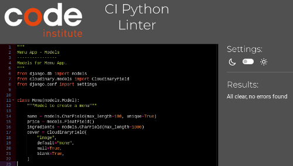
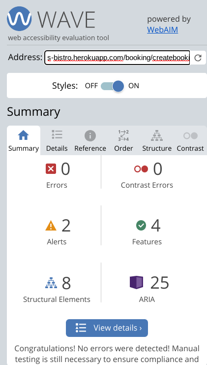
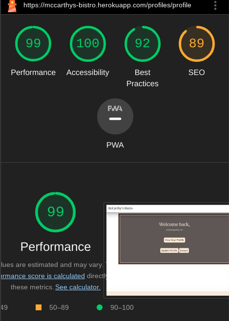
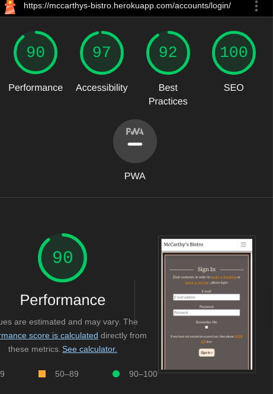

# Testing

Back to [README.md](README.md) 

## Table of contents
* [User Story and Feature Testing](#user-story-and-feature-testing)
* [Automated View Testing](#automated-view-testing)
* [Browser Testing](#browser-testing)
* [Functionality Testing](#functionality-testing)
* [Code Validation](#code-validation)
* [Bugs](#bugs)

## User Story and Feature Testing
All the user stories were tested manually, that including all the representative features, and were described below with a summary of the steps made for demonstrating the validation of the tests:  

### CONTENT AND NAVIGATION<
#### 1A: As a user, I want to see a navigation menu so I can easily navigate through website content  
* **Acceptance Criteria:** A site user should always have access to the navigation menu so he can easily switch between pages at any time.
* **Summary:** 
    -When a user visits the website he can easily see the navigation menu at the top of the page; 
    -Even if switching the pages, the menu is always present at the top and indicates what page is currently active; 
    -For the *Home* page, a *Back to top* button is present at the end of the content,(considering screen sizes can vary depending on device used,) and redirects the user to the top of the page where he can access the navigation links; 
    -For logged-in clients, the menu contains an additional page, *Profile*, and *Logout* link replaces *Register* and *Login* pages; 
    -For logged-in staff members, the navigation includes *Manage Bookings* page, which shows all the bookings. Whereas a normal client user will only have access to their own bookings  

    *By testing all these features, it can be affirmed that the user story is accomplished.* 
* **Outcome:** Pass

#### 1B: As a user, I want to see relevant information about the restaurant
* **Acceptance Criteria:** A site user should be able to see relevant information about the restaurant.
* **Summary:**   
    -When a user first visits the website, he is redirected to the *Home* page and a big cover with a pasta dish background is displayed; 
    -The cover also displays information about the name, year of opening and slogan of the restaurant; 
    -"About us" is a section on the *Home* page that describes the restaurant and another image of the restaurant interior; 
    -More information about the restaurant specialities and contact details can be found on the *Menu* and *Where to find us* pages.  

    *By testing all these features, it can be affirmed that the user story is accomplished.* 
* **Outcome:** Pass

#### 1C: As a user, I want the website to have a nice and intuitive design that will match the restaurant's theme
* **Acceptance Criteria:**  A site user should be able to access the content through an attractive design that would make him want to return to it anytime.
* **Summary:** 
    -When a user first visits the website he is redirected to *Home page* where the first impression is created when noticing the well-chosen fonts chosen for the navbar, title and slogan, as well as the cover image; 
    -The colours of the website were tested to match the contrast requirements and all the colours chosen were generated from the colours' palette of the background cover; 
    -Throughout the site there are elements created to help the user have a better experience when navigating through the content, such as hyperlinks, arrows redirecting to the next section of the page or a button to bring the user back to the top; 
    -On the Home, Menu and Reviews page, there are messages that suggest to the user to Register or Login to enjoy all the features of the website; 
    -The user gets feedback (bootstrap toasts,that automatically disappears after a few seconds) every time he performs an action such as Registering, Signing In/Signing Out, adding a booking, posting/updating a review, or updating a profile.  

    *By testing all these features, it can be affirmed that the user story is accomplished.* 
* **Outcome:** Pass 

### USER REGISTRATION/AUTENTHICATION
#### 2A: As a user, I want to be able to register on the website
* **Acceptance Criteria:** A site user should be able to create an account by filling in a form on the website.   
* **Summary:** 
    -There is a Register page that provides a form with email and password for the user to fill in; 
    -When the user submits the form a new entry is created in the Users table; 
    -A success message is displayed with the message "Logged in as..." that confirms to the user that he has been registered successfully.  

    *By testing all these features, it can be affirmed that the user story is accomplished.*  
* **Outcome:** Pass 
#### 2B: As a user, I want to be able to authenticate using only email and password
* **Acceptance Criteria:** A site user should be able to authenticate at any time with email and password.
* **Summary:** 
    -There is a Login page that provides a form with email and password to be filled; 
    -The authentication form has a "Remember me" checkbox that will keep the user logged in; 
    -A success alert is displayed with the message "Logged in as..." that confirms to the user that he has been logged in successfully.  

    *By testing all these features, it can be affirmed that the user story is accomplished.*  
* **Outcome:** Pass
#### 2C: As a user, I want to be able to logout at any time
* **Acceptance Criteria:** A site user should be able to exit current account at any time.
* **Summary:**    
    -There is a Logout modal that can be triggered when clicking on the hyperlink in the navbar. The modal is implemented as part of defensive programming; 
    -The logout modal asks the user again if he wishes to exit the current account; 
    -A success alert is displayed with the message "You have signed out" that confirms to the user that he has been successfully logged out.  
    
    *By testing all these features, it can be affirmed that the user story is accomplished.*  
* **Outcome:** Pass

### BOOKING
#### 3A: As a logged in user, I want to be able to book a reservation for a specific date, time and number of guests
* **Acceptance Criteria:** A logged user should be provided a booking system that generates the tables availability.  
* **Summary:**  
    -There is a booking page that can be accessed only by authenticated users, considering that all the booking entries must have the current user as the author; 
    -The booking sections appear successive only after the previous ones are validated; 
    -The first section contains inputs for Date, Start and End time, for the user to fill in; 
    -The validation of these values is very strict to prevent errors when generating the tables section. The following rules are being checked:
    * All the fields must be filled. 
    * The Date value should not be less than the current day; 
    * The user must choose from available time slots provided.  

    - If the validation is complete, and the user submits the form, a successful feedback in a form of a toast is provided; But if there's no available table for the capacity required a message feedback is also given and the guest cannot proceed with the booking. 

    *By testing all these features, it can be affirmed that the user story is accomplished.*  
* **Outcome:** Pass

### MENU
#### 4A: As a user, I want to see the restaurant's menu with details about ingredients and price, so that I can be completely aware of everything I want to order
* **Acceptance Criteria:** A user should be provided with a list of the menu content, as essential information for a restaurant client.
* **Summary:** 
    -There is a *Menu* page that can be accessed by any type of user; 
    -A list of meals is displayed and it is visible to any type of user; 
    -Every menu item is provided with an image of the meal, name, ingredients and price; 
    -All images have the same dimensions, with transparent backgrounds, and prices are in bold, for better visual impact.  
    
    *By testing all these features, it can be affirmed that the user story is accomplished.*  
* **Outcome:** Pass

#### 4B: As a logged in staff member, I want to be able to add, edit and delete dishes on the menu list
* **Acceptance Criteria:** A logged-in staff member can access the menu list via admin panel and should be able to add, edit and delete dishes from the menu list.
* **Summary:**  
-In the admin panel, the menu table with list items such as name, price and ingredients are presented.
-These can then be edited or deleted by any logged in staff member.
-Staff member can also add new dishes on the list.

    *By testing all these features, it can be affirmed that the user story is accomplished.*  
* **Outcome:** Pass 

### USER PROFILE
#### 5A: As a logged in user, I want to be able to view, and edit my profile
* **Acceptance Criteria:** A logged in user should be able to view and edit his profile. 
* **Summary:** 
    -There is a *Profile* page that is visible only to authenticated users; 
    -The user is given the possibility of letting the restaurant know of any dietary requirements or food allergies by updating their profile information.

    *By testing all these features, it can be affirmed that the user story is accomplished.*  
* **Outcome:** Pass

#### 5B: As a logged in user, I want to be able to edit or delete my bookings
* **Acceptance Criteria:** A logged in user should be provided a way to edit ordelete a booking if he no longer wishes to keep it. 
* **Summary:** 
    -In the Bookings page, the user is presented with all the bookings information in a form of a table.
    -All the field information on this table can be updated via an 'edit' button.
    -Bookings can also be deleted via a 'delete' button. 
    -When all these actions are performed a feedback is presented to the user.

    *By testing all these features, it can be affirmed that the user story is accomplished.*  
* **Outcome:** Pass

### STAFF MANAGE BOOKINGS
#### 6A: As a logged in staff member, I want to see the restaurant's upcoming bookings sorted by booking date and time
* **Acceptance Criteria:** A logged in staff member should be able to see all bookings from all the users via admin panel   
* **Summary:** 
    -There is a *Manage Bookings* page with all the bookings are visible only for logged-in staff members; 
    -The page displays all the bookings for the current day sorted by time, which is very helpful for a staff member that wants to take a look over today's reservations; 
    -The bookings are listed in a table and every column represents an important detail such as Date, Time, Number of guests, and Customer name; 

    *By testing all these features, it can be affirmed that the user story is accomplished.*  
* **Outcome:** Pass

#### 6B: As a logged in staff member, I want to be able to edit,cancel and/or delete bookings
* **Acceptance Criteria:** A logged-in staff member should be able to edit and delete any reservation from the database.
* **Summary:** 
    -Every row from the table represents a booking and the two last column contains an "Edit booking and "Delete booking" button;s 
    -When a staff member clicks on the button a toast is triggered for confirmation; 
    -But if its deleting a booking,a message asking for confirmation also displays the corresponding booking id, name, date and time for preventing an unwanted deletion; 
    -When a reservation is removed the corresponding row is immediately deleted from the table and if the list becomes empty, a suggestive message is displayed; 
    -When a reservation is removed, the page loads with the last date filter included, if existed one before the deletion. That creates a better user experience when managing the bookings;  

    *By testing all these features, it can be affirmed that the user story is accomplished.*  
* **Outcome:** 

### REVIEWS
#### 7A: As a user, I want to see the restaurant's customer reviews on the website
* **Acceptance Criteria:**  A user should have access to a way of seeing all the reviews added on the website for creating a better idea about the offered services.
* **Summary:** 
    -There is a page called "Reviews" that is accessible to all types of users; 
    -On the page there is a list of reviews paginated to display only 4 elements at a time for a better user experience; 
    -Every review element has an attractive design and contains relevant details such as User name, Review text, Star rating and Date and Time of posting; 
    -The reviews are ordered by time in a reverse way so that the last added review is the first on the list.  

    *By testing all these features, it can be affirmed that the user story is accomplished.*  
* **Outcome:** 

#### 7B: As a logged in user, I want to be able to post and edit a review
* **Acceptance Criteria:** A logged in user should be provided a way of adding and editing a review for the restaurant.
* **Summary:** 
    -On the *Review* page there is an "Add/Edit review" section only visible for authenticated users that are not staff members, as this action wouldn't make sense for admins to make; 
    -For a user that hasn't already added a review to the list, there is a form to fill in for creating one; 
    -The form only contains an input  for the review message to be posted, and a star rating functionality was implemented with a default value of 1 star; 
    -There is no implementation for approval of the review because a restaurant has to have real and transparent opinions; 
    -When the review is posted, an alert is triggered confirming that the review was successfully added to the list; 
    -The response is immediate and the review appears as the first on the list; 
    -If the current user already added his review, it is displayed in the section "Your review"; 
    -For editing the review, a form is displayed when the user clicks on the *Update* button; 
    -The form already contains the text of the review to be edited, and the Star rating feature has by default the initial value; 
    -When the user submits the edited review, an alert is triggered to confirm that the update was successful; 
    -The date and time are updated with the current ones and the review becomes first on the list; 
    -"Your review" section updates its values as well;   

    *By testing all these features, it can be affirmed that the user story is accomplished.*  
* **Outcome:** 

### CONTACT
#### 8A: As a user, I want to see the restaurant's opening and closing hours
* **Acceptance Criteria:** A site user should be provided information about opening and closing hours for every day.
* **Summary:**   
    -There is a page called "Where to find us" visible to any type of user; 
    -The page displays a container with the timetable for every day of the week; 
    -The timetable has a simple and attractive design and the information is clear.  

     *By testing all these features, it can be affirmed that the user story is accomplished.*  
* **Outcome:** Pass
#### 8B: As a user, I want to see location information on the website
* **Acceptance Criteria:** A site user should be provided information about restaurant's location.
* **Summary:** 
    -On the "Where to find us" page there is a google map with a marker pointed to the restaurant's location; 
    -Also there is an informative text with the address of the restaurant;  

    *By testing all these features, it can be affirmed that the user story is accomplished.*  
* **Outcome:** Pass
#### 8C: As a user, I want to see contact information on the website
* **Acceptance Criteria:** A site user should be provided the restaurant's contact information.
* **Summary:**  
    -On the "Where to find us" page there is a section with contact information; 
    -The section displays the phone number and contact email for the restaurant.  

    *By testing all these features, it can be affirmed that the user story is accomplished.*  
* **Outcome:** Pass

### Aditional Manual Testing
#### Error Handling

* Ensure that **403 HTTP** errors display custom 403.html.
    - **Stress Test:** Input a route in the URL for accessing another user content
* Ensure that **404 HTTP** errors display the custom 404.html.
    - **Stress Test:** Input a random route in the URL that can't be found in the declared paths of the project
* Ensure that **500 HTTP** errors display the custom 500.html.
    - **Stress Test:** Set debug to false and try to access a path that has been broken intentionally.

#### Interface Interaction

* Ensure all interactive elements respond appropriately:
    - **Desktop:**
        - All navbar elements correctly respond to hovering.
        - All buttons correctly respond to hovering.
        - All authentication links correctly respond to hovering
    - **Mobile:**
        - All navbar elements correctly respond to touch.
        - All buttons correctly respond to touch.
        - All authentication links correctly respond to touch

#### Links

* Ensure the external links to social media present in the footer open up in new tabs.

## Functionality testing

Comprehensive testing has been conducted to ensure that all website functionalities are working as intended, providing users with a reliable and enjoyable browsing experience.

| Functionality | What's being tested | Result |
|------|-------------|--------|
| Registration | A new user can create an account successfully. | Pass |
|  | The website validates user inputs (2 password inputs match, email address is valid). | Pass |
|  | The website displays an appropriate error message with hint when validation fails. | Pass |
|  | The website displays an appropriate message if link is invalid or token expired | Pass |
|  | User is signed in automatically when click confirm button | Pass |
| Admin Panel | Admin can login to admin panel. | Pass |
|  | Admin can add, edit and delete bookings. | Pass |
|  | Admin can add edit and delete menu items. | Pass |
|  | Admin can add and delete tables. | Pass |
|  | Admin can delete users. | Pass|
|  | Admin panel can not be accesed by regular user (unauthorized) | Pass |
|  | Admin panel can be accessed by staff user| Pass |
|Login | A registered user can log in successfully. | Pass |
|  | The website displays an appropriate error message when a user enters an incorrect email or password. | Pass |
|  | A logged-in user can sign out successfully. | Pass |
|  | A logged-in user is asked for sign out confirmation.  | Pass |
|  | Click on confirm modal sign out user.  | Pass |
|Profile CRUD | Verify that a logged-in user can create and edit his profile. | Pass |
|  | The website displays an appropriate error message when a user enters invalid data (e.g., date before current day, not allowed charset). | Pass |
|  | A user can edit own profile and save or cancel changes | Pass |
|  | A user cannot edit or delete another user's profile (check manual url change) | Pass |
|  | Confirmation message is displayed when profile is updated | Pass |
|  | Only authenticated users can edit their own profile | Pass |
|Bookings CRUD | Verify that a logged-in user can create, edit delete his own bookings. | Pass |
|  | Confirmation message is displayed when changes are saved | Pass |
|  | User is asked for confirmation before deleting booking| Pass |
|  | Click on delete confirmation button deletes bookings | Pass |
|  | A user can delete own bookings | Pass |
|  | Only authenticated users can book reservations | Pass |
|  | Confirmation message is displayed when booking is updated or deleted | Pass |
|Menu| A logged-in  staff user can add, edit or delete menu items. | Pass |
|Reviews | All users can view all reviews| Fail |
|  |Authenticated users can write reviews | Pass |
|  |Unauthenticated users cannot write reviews | Pass |

## Code Validation
### HTML

The html code of the website was validated using [W3 Markup Validator](https://validator.w3.org/). 
For pages that require authentication I used "validate by direct input" method with source code. 
At the time of deployment the validation have the following outcome:  

The following pages have been tested by direct input:
* Home
* Menu
* Make a booking
* Where to find us
* Reviews
* Profile
* Manage bookings
* Login/Register/Logout
* 403/404/500 custom pages

| Template | Validation Result |  Final validation
|--------|-----------|---------|
| index.html | no errors | pass|
| menu.html | no errors | pass |
| reviews.html | no errors | pass |
| contact.html | no errors | pass
| booking.html | no errors | pass
| managebookings.html | no errors | pass ||
| profile.html | no errors| pass
| 404.html | no errors | pass |
| 500.html | no errors | pass |
| 403.html | no errors | pass |
| signup.html | no errors | pass |
| logout.html | no errors | pass |
| login.html | no errors | pass |

### CSS

The CSS code was validated using [W3 Jigsaw Validator](https://jigsaw.w3.org/css-validator/) 
At the time of deployment the validation for *style.css* has the following outcome:  

### Javascript

The Javascript code was validated using using [JsHint](https://jshint.com/) 
At the time of deployment the validation for *script.js* has the following outcome:  

* The warnings appeared because of EventListeners added to elements in a loop. 
I tried to solve the issue but no successful method has been found, so I chose to ignore the warning as it is not affecting the way my code works in any way.
* The script for defining the google map present in the *Where to find us page* contains *google* and *map* variables that generate the errors in the linter. As this is a script taken from the [Google Developers Website](https://developers.google.com/maps/documentation/javascript/adding-a-google-map), I choose to ignore this issue as well as there is no fix found for it. 

### Python
The python code was tested using [PEP8ci](https://pep8ci.herokuapp.com/) validator. 

**Pep8 results:** 

Main app

* **settings.py** 

* **urls.py** 

Booking Page

* **admin.py** 

* **forms.py** 

* **models.py** 

* **urls.py** 

* **views.py** 

Contact Page

* **urls.py** 

* **views.py** 

Home Page

* **admin.py** 

* **apps.py** 

* **forms.py** 

* **models.py** 

* **urls.py** 

* **views.py** 

Menu Page

* **admin.py** 

* **forms.py** 

* **models.py** 

* **views.py** 

Profiles Page

* **admin.py** 

* **forms.py** 

* **models.py** 

* **urls.py** 

* **views.py** 

Reviews Page

* **admin.py** 

* **forms.py** 

* **models.py** 

* **urls.py** 

* **views.py** 

### Accesibility 
The accesibility of the website was tested with [Wave](https://wave.webaim.org/)

**Wave results:** 

Home page

  

Menu page

  

Register page

  

login page

  

Contact page

  

Bookings page

  

Manage Bookings page

  

403 Error  page

  

404 Error  page

  

500 Error  page

  

### Performance
The performance of the website was tested with Lighthouse

**Lighthouse reports:** 

Desktop

* Home page 
 

* Menu page 
 

* Contact page 
 

* Reviews page 
 

* Bookings page 
 

* Manage Bookings page 
 

* Profile page 
 

* Register page 
 

* Login page 
 

Mobile

* Home page 
 

* Menu page 
 

* Contact page 
 

* Reviews page 
 

* Bookings page 
 

* Manage Bookings page 
 

* Profile page 
 

* Register page 
 

* Login page 
 

## Bugs 
I encountered countless bugs during the whole process of building this project. Most of them I was able to fix on time, but unfortunately, due to time constraint the ones listed below are still yet to be fixed. And I will do my best to resolve them on future release.
* **Default placeholder on name input in the booking form.**
    When a user navigate to the bookings page, the booking form name input field has a default placeholder.
    This is because I added this input field after my initial migration. Getting rid of it means emptying my database and doing another migration. 

* **A user can still book even when the booking time is  before the current time.**

* **The manage bookings page is not responsive on mobile devices.**

* **The reviews are not showing on the reviews page.**

    

Back to [README.md](README.md) 